# End-to-End Machine Learning Pipeline with Databricks and Terraform

This project is designed to develop a scalable machine learning pipeline using Databricks, with cloud infrastructure provisioned through Terraform. The workflow includes data processing, model training, hyperparameter optimization, and deployment for real-time inference.

---

## Objectives and Key Activities

### **Infrastructure Setup**
- Cloud resources are provisioned using Terraform scripts.
- Azure is used to store data and enable computation.

### **Data Processing and Visualization**
- Datasets are imported into the Databricks File System (DBFS).
- Data insights are visualized using Python libraries, such as Seaborn and Matplotlib.

### **Model Training and Evaluation**
- A parallel hyperparameter sweep is conducted to optimize model performance.
- MLflow is utilized to log experiments and manage model versions.

### **Deployment**
- The best-performing model is registered in MLflow.
- The registered model is applied to a new dataset through a Spark UDF.
- Model serving is set up to enable real-time predictions.

---

## Tools and Requirements

Before the project is started, the following tools and resources should be prepared:

- **Cloud Account:** An active account on Azure.
- **Terraform:** Installed locally for automated resource provisioning.
- **Databricks Workspace:** A configured cluster with sufficient memory and CPU.
- **Python Libraries:** Including Seaborn, Matplotlib, and dependencies for machine learning tasks.
- **MLflow:** Enabled for experiment tracking and model deployment.

---

## Step-by-Step Instructions

### **1. Repository Setup**

The repository is forked and cloned to the local machine:

```bash
git clone git@git.epam.com:abdullah_duman/m08_sparkml_python_azure.git
cd m08_sparkml_python_azure.git
```
### **2. Resource Provisioning**

Terraform scripts are initialized and applied to create cloud resources:

```bash
terraform init
terraform plan
terraform apply
```

After executing the Terraform scripts, the following resources have been created in Azure:

1. **Azure Resource Group**: A container to manage and group related resources.  
2. **Azure Storage Account**: Used for storing data such as blobs, files, and queues.  
3. **Azure Databricks Service**: A managed platform for big data analytics and machine learning workloads.


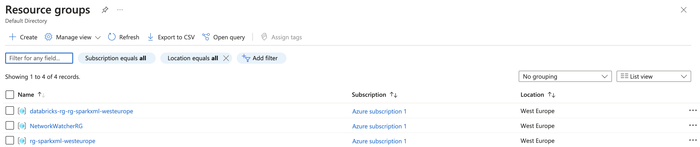
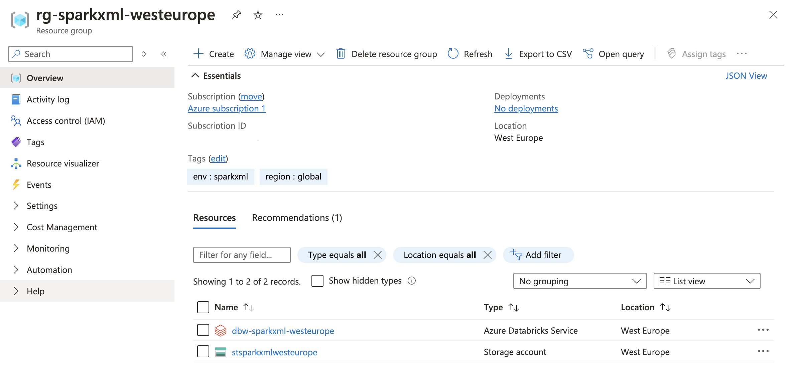


### **3. Creating an Azure Databricks Cluster**

## Cluster Configuration

1. **Name:** Abdullah Duman's Cluster  
   - The name of the cluster to identify it in the workspace.

2. **Cluster Mode:** Single Node / Multi Node  
   - Single Node for lightweight tasks.  
   - Multi Node for distributed workloads.

3. **Access Mode:** Single User  
   - Restricts cluster access to a specific user for security.

4. **Runtime Version:** 12.2 LTS (Scala 2.12, Spark 3.3.2)  
   - Provides the software environment for running jobs (long-term support).

5. **Photon Acceleration:** Enabled  
   - Improves query performance using advanced optimization techniques.

6. **Node Type:** Standard_DS3_v2 (14 GB Memory, 4 Cores)  
   - Specifies the virtual machine size for the cluster.

7. **Auto Termination:** 120 minutes of inactivity  
   - Automatically shuts down the cluster to save costs when not in use.


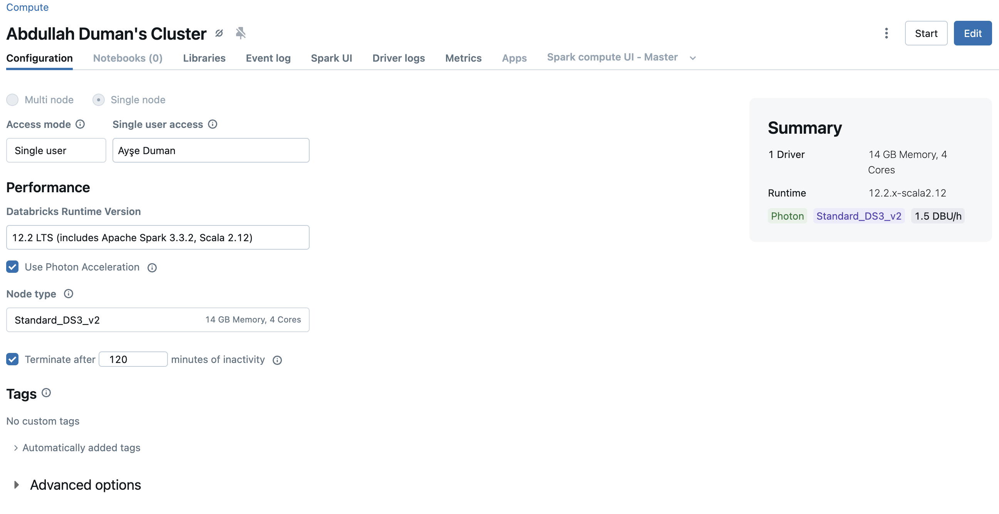

1. The files `winequality-red.csv` and `winequality-white.csv` should be uploaded to the Databricks File System (DBFS).  
2. This can be done by selecting **File > Upload Data** in the Databricks notebook and dragging the files to the upload target.  

### **4. Uploading Data to Databricksr**

1. The files `winequality-red.csv` and `winequality-white.csv` should be uploaded to the Databricks File System (DBFS).  
2. This can be done by selecting **File > Upload Data** in the Databricks notebook and dragging the files to the upload target.  

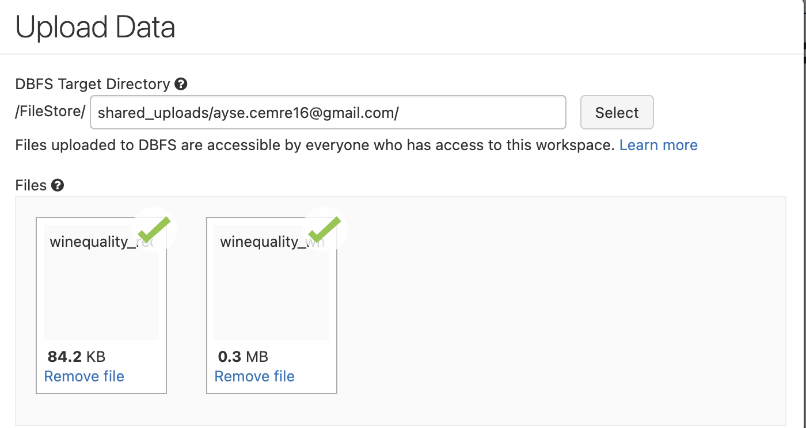

### **5. Required Packages Installation**

The following packages should be installed in the Databricks environment:

1. **mlflow**  
   ```python
   %pip install mlflow
   ```
2. **cloudpickle**  
    ```python
    %pip install cloudpickle
    ```    
3. **hyperopt**
    ```python
    %pip install hyperopt
    ```
4. **xgboost**
    ```python
    %pip install xgboost
    ```
These commands should be run in a Databricks notebook cell to ensure the required packages are installed.

### **6. Loading the Data**

#### Instructions for Uploading Data:
- If the **File > Upload Data** menu option is available, follow the instructions from the previous cell to upload the data from your local machine.

#### Code for Reference:
The following code can be used to read the uploaded data into a Pandas DataFrame. Replace `<username>` with your Databricks username.

```python
import pandas as pd

# Reading the uploaded data from DBFS
white_wine = pd.read_csv("/dbfs/FileStore/shared_uploads/<username>/winequality_white.csv", sep=';')
red_wine = pd.read_csv("/dbfs/FileStore/shared_uploads/<username>/winequality_red.csv", sep=';')
```

### **7. Merging the DataFrames**

The two DataFrames, `red_wine` and `white_wine`, should be merged into a single dataset with a new binary feature, `is_red`, that indicates whether the wine is red or white.

#### Code for Merging:

```python
# Adding a new binary feature 'is_red'
red_wine['is_red'] = 1  # Indicates the wine is red
white_wine['is_red'] = 0  # Indicates the wine is white

# Merging the DataFrames into a single dataset
data = pd.concat([red_wine, white_wine], axis=0)

# Removing spaces from column names for consistency
data.rename(columns=lambda x: x.replace(' ', '_'), inplace=True)
```

#### Explanation:
- The `is_red` column is set to `1` for `red_wine` and `0` for `white_wine` to differentiate between red and white wines.
- The `pd.concat()` function combines the two DataFrames vertically (`axis=0`).
- The `rename()` method removes any spaces from the column names for easier access and consistency in further data processing.


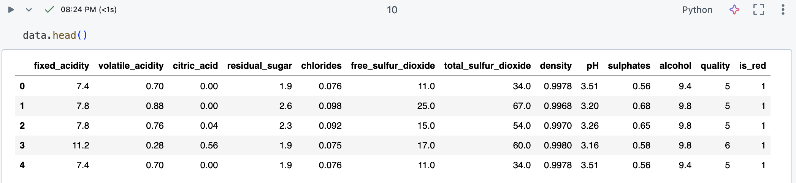

### **8. Data Visualization**

Before training a model, it is essential to explore the dataset using data visualization tools like Seaborn and Matplotlib.

#### Plotting a Histogram of the Dependent Variable:

```python
import seaborn as sns

# Plotting a histogram of the 'quality' column without the kernel density estimate
sns.distplot(data.quality, kde=False)
```
#### Explanation:
- The `is_red` column is created to indicate the type of wine, with `1` for `red_wine` and `0` for `white_wine`.
- The `pd.concat()` function is used to merge the two DataFrames into a single dataset by stacking them vertically (`axis=0`).
- The `rename()` method is applied to remove spaces from column names, making them easier to reference in the code.

#### Observations:
- A histogram of the `quality` column is plotted to show the distribution of wine quality scores.
- From the plot, it can be seen that the quality scores are generally distributed in a range from 3 to 9, suggesting a normal distribution with most scores centered around the mid-range values.

### **9 Defining High-Quality Wine and Visual Analysis**

#### Defining High-Quality Wine:
A wine is considered high quality if its quality score is greater than or equal to 7. This can be represented by creating a binary variable where `1` indicates high quality and `0` indicates low quality.

```python
high_quality = (data.quality >= 7).astype(int)
data.quality = high_quality
```
#### Visual Analysis with Box Plots

Box plots are valuable for visualizing the distribution of a feature in relation to a binary label, such as the high quality of wine. This helps identify potential correlations between the feature and the quality of wine.

##### Code for Box Plot Visualization:

```python
import matplotlib.pyplot as plt

# Setting the dimensions for the subplots
dims = (3, 4)

# Creating subplots for visualization
f, axes = plt.subplots(dims[0], dims[1], figsize=(25, 15))
axis_i, axis_j = 0, 0

# Iterating through columns to plot box plots for relevant features
for col in data.columns:
  if col == 'is_red' or col == 'quality':
    continue  # Skipping indicator variables as box plots are not suitable for them
  sns.boxplot(x=high_quality, y=data[col], ax=axes[axis_i, axis_j])
  axis_j += 1
  if axis_j == dims[1]:
    axis_i += 1
    axis_j = 0
```
#### Observations:
The box plots reveal certain features that stand out as good univariate predictors of wine quality:

- **Alcohol Content**: The box plot for alcohol content shows that the median alcohol level in high-quality wines is higher than even the 75th percentile of low-quality wines. This indicates a positive correlation between high alcohol content and wine quality.
- **Density**: The density box plot illustrates that low-quality wines tend to have higher density values than high-quality wines, suggesting an inverse correlation between density and wine quality.

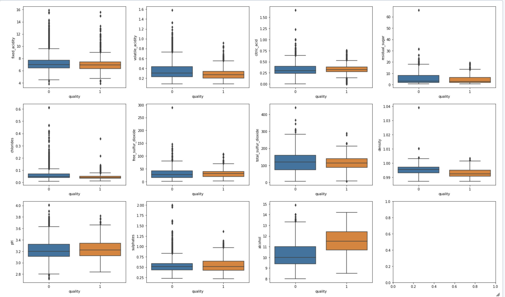

### **10. Preprocessing Data**
Before training a model, it is important to check for missing values and split the data into training and validation sets.

### Checking for Missing Values:
```python
data.isna().any()
```
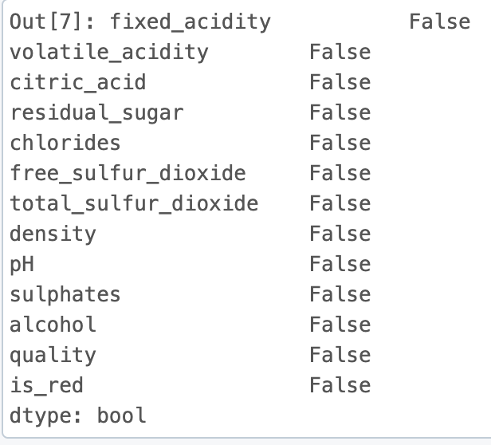

As it can be seen from the above screenshot, there are no missing values in the dataset.

### **11. Splitting the Data:**
To prepare the data for model training, the dataset is split into training and test sets. This allows for the evaluation of the model's performance on unseen data.

```python
from sklearn.model_selection import train_test_split

# Splitting the data into training and test sets
train, test = train_test_split(data, random_state=123)

# Defining features and target variables
X_train = train.drop(["quality"], axis=1)
X_test = test.drop(["quality"], axis=1)
y_train = train.quality
y_test = test.quality
```
#### Explanation:
The `train_test_split()` function is used to randomly divide the dataset into training and test sets. The features (`X_train` and `X_test`) are created by dropping the `quality` column, while the target variable (`y_train` and `y_test`) is set as the `quality` column.

### **12. Building a Baseline Model:**
A random forest classifier is used to build a baseline model for binary classification tasks, as it can handle interactions between multiple features effectively.

The following code demonstrates the process of building a simple random forest classifier using scikit-learn, with MLflow used to track model performance and save the model for future use.

```python
import mlflow
import mlflow.pyfunc
import mlflow.sklearn
import numpy as np
import sklearn
import cloudpickle
from sklearn.ensemble import RandomForestClassifier
from sklearn.metrics import roc_auc_score
from mlflow.models.signature import infer_signature
from mlflow.utils.environment import _mlflow_conda_env

# The predict method of sklearn's RandomForestClassifier returns a binary classification (0 or 1).
# The following code creates a wrapper function, SklearnModelWrapper, that uses 
# the predict_proba method to return the probability that the observation belongs to each class.

class SklearnModelWrapper(mlflow.pyfunc.PythonModel):
    def __init__(self, model):
        self.model = model
    
    def predict(self, context, model_input):
        return self.model.predict_proba(model_input)[:, 1]

# mlflow.start_run creates a new MLflow run to track the performance of this model.
# Within the context, you call mlflow.log_param to keep track of the parameters used, and
# mlflow.log_metric to record metrics like accuracy.
with mlflow.start_run(run_name='untuned_random_forest'):
    n_estimators = 10
    model = RandomForestClassifier(n_estimators=n_estimators, random_state=np.random.RandomState(123))
    model.fit(X_train, y_train)

    # predict_proba returns [prob_negative, prob_positive], so slice the output with [:, 1]
    predictions_test = model.predict_proba(X_test)[:, 1]
    auc_score = roc_auc_score(y_test, predictions_test)
    mlflow.log_param('n_estimators', n_estimators)
    # Use the area under the ROC curve as a metric.
    mlflow.log_metric('auc', auc_score)
    
    wrappedModel = SklearnModelWrapper(model)
    # Log the model with a signature that defines the schema of the model's inputs and outputs.
    signature = infer_signature(X_train, wrappedModel.predict(None, X_train))

    # MLflow creates a conda environment file to serve models with necessary dependencies.
    conda_env = _mlflow_conda_env(
        additional_conda_deps=None,
        additional_pip_deps=["cloudpickle=={}".format(cloudpickle.__version__), "scikit-learn=={}".format(sklearn.__version__)],
        additional_conda_channels=None,
    )
    mlflow.pyfunc.log_model("random_forest_model", python_model=wrappedModel, conda_env=conda_env, signature=signature)
```

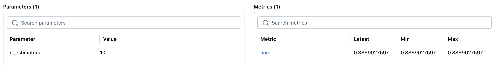


### Explanation:
The `train_test_split()` function is used to split the dataset into training and test sets. A random forest classifier is trained on the training data, and the model's performance is evaluated using the AUC score, which is recorded with MLflow. The model is wrapped with a custom Python class to handle the `predict_proba` method, and its input/output signature is inferred for better tracking and validation. MLflow also logs the model along with the required environment dependencies for reproducibility.

### **13. Feature Importances:**
The feature importances of the model are examined to ensure that the most relevant variables are contributing to the prediction of wine quality. The `feature_importances_` attribute of the trained random forest model is used to create a DataFrame that lists each feature alongside its importance score.

```python
feature_importances = pd.DataFrame(model.feature_importances_, index=X_train.columns.tolist(), columns=['importance'])
feature_importances.sort_values('importance', ascending=False)
```
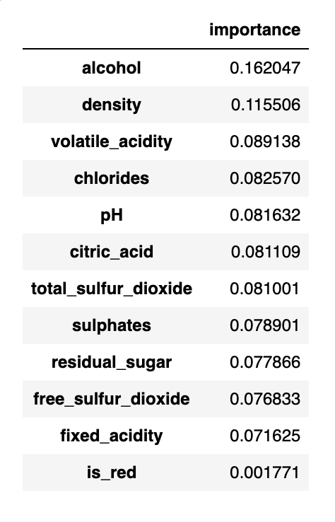

#### Observations:
As shown in the boxplots earlier, both **alcohol** and **density** are significant in predicting wine quality. The feature importance scores confirm that these variables have a notable impact, supporting their relevance as predictors in the model.

### **14. Registering the Model in the MLflow Model Registry**

The trained model is registered in the MLflow Model Registry to enable seamless access and usage across Databricks.

```python
# Retrieve the run ID of the model
run_id = mlflow.search_runs(filter_string='tags.mlflow.runName = "untuned_random_forest"').iloc[0].run_id

# Define a name for the model
model_name = "wine_quality"

# Register the model in the registry
model_version = mlflow.register_model(f"runs:/{run_id}/random_forest_model", model_name)
```
After registration, the wine_quality model can be viewed in the Models page within the Databricks interface. The Models page is accessed by clicking the corresponding icon in the left sidebar.


#### Benefits:
- Model tracking and versioning are centralized in a single registry, ensuring better organization and traceability.  
- The model can be easily deployed and reused in different workflows, streamlining the integration process.  

### **15. Transitioning the Model to Production**

The model is transitioned to the "Production" stage within the MLflow Model Registry, allowing it to be referenced and deployed as a production-ready model.

```python
from mlflow.tracking import MlflowClient

# Transition the model version to production
client = MlflowClient()
client.transition_model_version_stage(
  name=model_name,
  version=model_version.version,
  stage="Production",
)

# Load the production model
model = mlflow.pyfunc.load_model(f"models:/{model_name}/production")

# Verify the model's performance
print(f'AUC: {roc_auc_score(y_test, model.predict(X_test))}')
```
#### Observations:
- The model was successfully transitioned to the **"Production"** stage, as verified on the Models page.
- It is now accessible using the path `models:/wine-quality/production`.
- A sanity check confirmed that the model's AUC score remains consistent at **0.8889**, aligning with the previously logged value.

### **16. Experimenting with a New Model Using XGBoost and Hyperopt**

The code demonstrates training an XGBoost model with hyperparameter optimization using Hyperopt and parallel processing via SparkTrials. MLflow is used to log and track experiments and model performance.

```python
from hyperopt import fmin, tpe, hp, SparkTrials, STATUS_OK
from hyperopt.pyll import scope
from sklearn.metrics import roc_auc_score
import mlflow.xgboost
import xgboost as xgb
import numpy as np

# Define hyperparameter search space
search_space = {
    'max_depth': scope.int(hp.quniform('max_depth', 4, 20, 1)),
    'learning_rate': hp.loguniform('learning_rate', -3, -1),
    'reg_alpha': hp.loguniform('reg_alpha', -5, -2),
    'reg_lambda': hp.loguniform('reg_lambda', -6, -2),
    'min_child_weight': hp.loguniform('min_child_weight', 0, 2),
    'objective': 'binary:logistic',
    'seed': 123
}

# Model training and logging function
def train_model(params):
    mlflow.xgboost.autolog()
    with mlflow.start_run(nested=True):
        train = xgb.DMatrix(data=X_train, label=y_train)
        test = xgb.DMatrix(data=X_test, label=y_test)

        booster = xgb.train(
            params=params,
            dtrain=train,
            num_boost_round=500,
            evals=[(test, "test")],
            early_stopping_rounds=20
        )

        predictions_test = booster.predict(test)
        auc_score = roc_auc_score(y_test, predictions_test)
        mlflow.log_metric("auc", auc_score)

        return {"status": STATUS_OK, "loss": -1 * auc_score, "model": booster}

# Run hyperparameter optimization with SparkTrials
spark_trials = SparkTrials(parallelism=20)
with mlflow.start_run(run_name="xgboost_models") as run:
    best_result = fmin(
        fn=train_model,
        space=search_space,
        algo=tpe.suggest,
        max_evals=50,
        trials=spark_trials,
        rstate=np.random.default_rng(123)
    )

# Log the best model
best_result = spark_trials.results[np.argmin([r["loss"] for r in spark_trials.results])]
booster = best_result["model"]
if booster is not None:
    train_dmatrix = xgb.DMatrix(data=X_train, label=y_train)
    signature = infer_signature(X_train, booster.predict(train_dmatrix))
    mlflow.xgboost.log_model(booster, "model", signature=signature)

print("Model successfully logged!")
```

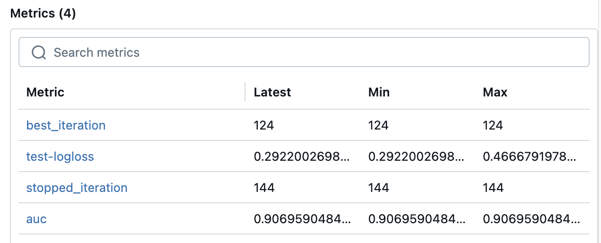

#### Observations:
- The script trains an XGBoost model and performs hyperparameter optimization in parallel.
- Each training run's AUC score is logged, allowing comparison across configurations.
- The final model is stored and can be retrieved for further analysis or deployment.

### **17. Logging and Retrieving the Best Model with MLflow**

You used MLflow to log the models produced by each hyperparameter configuration during training. The following code snippet demonstrates how to identify the best performing model run, load it, and re-log it to the MLflow model registry.

```python
# Find the best run on MLflow
best_run = mlflow.search_runs(order_by=['metrics.auc DESC']).iloc[0]
print(f"AUC of Best Run: {best_run['metrics.auc']}")

# Get the model URI from the best run
model_uri = f"runs:/{best_run.run_id}/model"

# Load the model from MLflow
try:
    best_model = mlflow.xgboost.load_model(model_uri)
    print("Model successfully loaded!")

    # Create a signature for re-logging
    train_dmatrix = xgb.DMatrix(data=X_train, label=y_train)
    signature = infer_signature(X_train, best_model.predict(train_dmatrix))
    
    # Re-log the model
    mlflow.xgboost.log_model(best_model, "model", signature=signature)
    print("Model successfully re-logged!")
except Exception as e:
    print(f"Error occurred while loading or re-logging the model: {e}")
```
#### Observations:

- The best model was identified with an AUC score of 0.9191.
- The code logs the model to the MLflow model registry, making it available for production deployment or further use.

### **18. Updating the Production Model in the MLflow Model Registry**

The following steps outline how to log a new model version and promote it to production in the MLflow Model Registry.

#### 1. Log the new model version
To log the model produced by the best hyperparameter configuration:

```python
mlflow.xgboost.log_model(booster, "model", signature=signature)
```

#### 2. Register the New Model Version
Register the model from the best run to the model registry:

```python
new_model_version = mlflow.register_model(f"runs:/{best_run.run_id}/model", model_name)
```

#### 3. Archive the Old Model Version and Promote the New One to Production

```python
# Archive the old model version
client.transition_model_version_stage(
  name=model_name,
  version=model_version.version,
  stage="Archived"
)

# Promote the new model version to Production
client.transition_model_version_stage(
  name=model_name,
  version=new_model_version.version,
  stage="Production"
)
```

#### 4. Load and Verify the New Model

```python
# Load the updated production model
model = mlflow.pyfunc.load_model(f"models:/{model_name}/production")
print(f'AUC: {roc_auc_score(y_test, model.predict(X_test))}')
```

### Observations


- The old model version is archived, and the new version is now the active production model.
- Clients accessing the model using `mlflow.pyfunc.load_model` will receive the new version automatically.
- The new model version has an AUC score of 0.9191, confirming its improved performance.

### **19. Batch Inference**

Batch inference is a method used to evaluate a model on a batch of new data. This can be useful for running model evaluations on a fresh dataset or comparing the performance of different models on the same data set.

The following code snippet demonstrates how to evaluate the model on data stored in a Delta table using Spark for parallel computation:

1. **Save the Existing Data to a Delta Table**:
   This step simulates a new corpus of data. In practice, this would be replaced with your new batch of data.

```python
# Create a Spark DataFrame from X_train
spark_df = spark.createDataFrame(X_train)

# Define the path for the Delta table
# Replace <username> with your actual username before running this cell.
table_path = "dbfs:/ayse.cemre16@gmail.com/delta/wine_data"

# Delete the contents of this path if this cell has already been run
dbutils.fs.rm(table_path, True)

# Save the DataFrame to the Delta table
spark_df.write.format("delta").save(table_path)
```

2. **Load the Model into a Spark UDF**:

This step loads the trained model into a Spark User Defined Function (UDF), enabling it to be applied to data stored in a Delta table for batch inference.

```python
import mlflow.pyfunc

# Load the model as a Spark UDF
apply_model_udf = mlflow.pyfunc.spark_udf(spark, f"models:/{model_name}/production")
```

3. **Read the New Data from Delta:** 

Load the data from the Delta table and display it for inspection.

```python
# Read the "new data" from the Delta table
new_data = spark.read.format("delta").load(table_path)

# Display the new data
display(new_data)
```
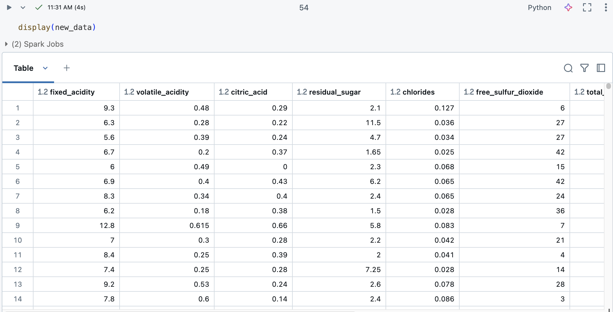

4. **Apply the Model to the New Data:**

Use the model to generate predictions on the new data.

```python
from pyspark.sql.functions import struct

# Create a structure for the UDF inputs
udf_inputs = struct(*(X_train.columns.tolist()))

# Apply the model to the new data
new_data = new_data.withColumn(
  "prediction",
  apply_model_udf(udf_inputs)
)

# Display the data with predictions
display(new_data)
```

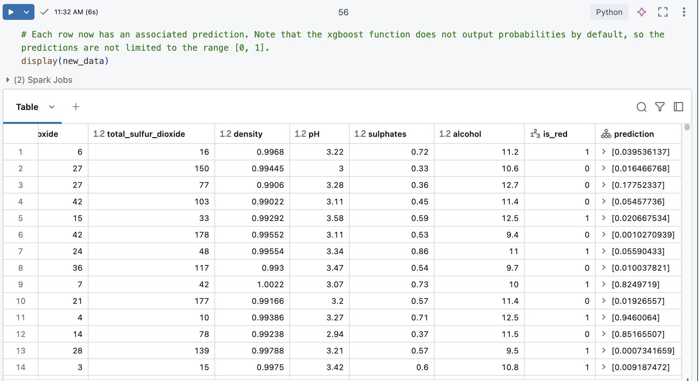

### Observations

- Each row in the `new_data` DataFrame now includes an associated prediction.
- Note that the XGBoost function used in this context does not output probabilities by default. Therefore, the predictions generated may not be constrained to the range [0, 1].

### **5. Final Step: Destroy All Resources**

To remove all resources created by this Terraform configuration, execute:

```bash
terraform destroy
```

### Conclusion

This project demonstrated the process of deploying a machine learning model on Databricks and configuring it for serving predictions. Key steps included setting up the Databricks cluster, integrating the model with MLflow, and establishing secure access with appropriate tokens. Challenges such as handling authentication issues, managing compute resources, and ensuring that the model serving endpoint was properly configured were addressed.

Additionally, using Terraform for infrastructure as code allowed us to efficiently manage and deploy cloud resources on Azure, ensuring that the environment was consistently set up according to project requirements. By automating resource provisioning and configuration, we improved reproducibility and reduced manual overhead.

Ultimately, this project served as a comprehensive exercise in cloud-based model deployment, offering valuable insights into the best practices for scaling machine learning solutions and managing cloud infrastructure effectively.

